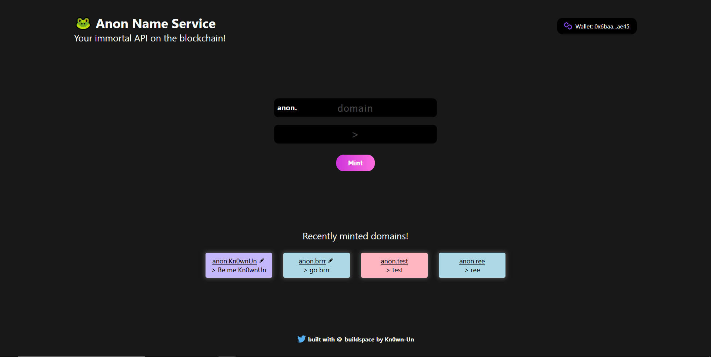

# Anon Naming Service

A naming sevice built on polygon (test) network.

## What's an ENS?

The Ethereum Name Service (ENS) is a distributed, open, and extensible naming system based on the Ethereum blockchain.

ENS’s job is to map human-readable names like ‘alice.eth’ to machine-readable identifiers such as Ethereum addresses, other cryptocurrency addresses, content hashes, and metadata. ENS also supports ‘reverse resolution’, making it possible to associate metadata such as canonical names or interface descriptions with Ethereum addresses.

## What's Polygon?

Polygon is a “layer two” or “sidechain” scaling solution that runs alongside the Ethereum blockchain — allowing for speedy transactions and low fees. MATIC is the network’s native cryptocurrency, which is used for fees, staking, and more.

This project was made with [@buildspace](https://github.com/buildspace) and it focuses on what a Naming service is and how it works.

### [View Demo 👀](https://kn0wn-un.github.io/polygon-domains-nft/)

### [View Contract 📄](https://mumbai.polygonscan.com/address/0x80Dea5F049d72e4750862f842C62E44E97be5a1D)

### [View NFTs ✨](https://testnets.opensea.io/collection/anon-name-service-v3)

